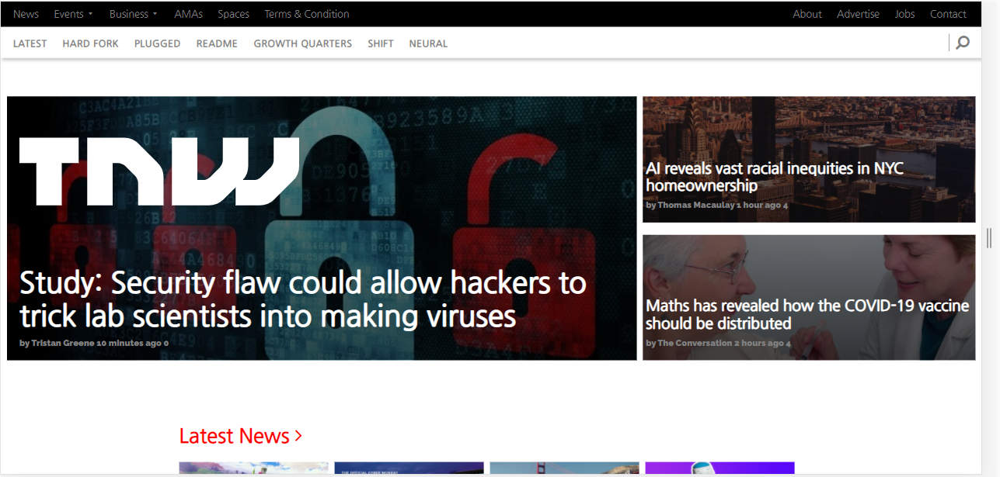
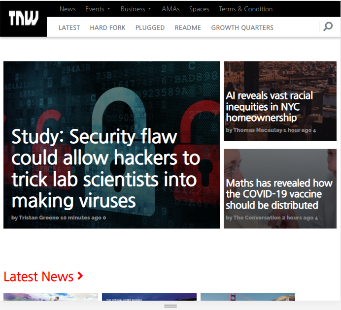
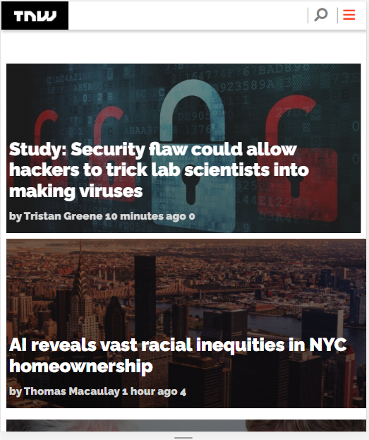

# Responsive Design

> This is the first project for the week 2.

## ** For Desktop **

## ** For Tablet **

## ** For Mobile **

This is a clone of a The Next Web made from scratch using sematic HTML and CSS3.

## Built With

- HTML5
- CSS
- Git
- Linter checks

## Live Demo

[Live Demo Link](https://gracetemitope.github.io/TNW-Project/)

## Authors

👤 **Ajanaku Temitope Grace**

- GitHub: [@Gracetemitope]: (https://github.com/Gracetemitope)
- Twitter: [@DevGrachy]: (https://twitter.com/DevGrachy)

👤 **Abdul Khaliq**

- GitHub: [@AK-Devil](https://github.com/AK-Devil)
- Twitter: [@AbdulKh99672072](https://twitter.com/AbdulKh99672072)
- LinkedIn: [LinkedIn](https://linkedin.com/abdul-khaliq-89452b1a9)

## 🤝 Contributing

Contributions, issues, and feature requests are welcome!

Feel free to check the [issues page](issues/).

## Show your support

Give a ⭐️ if you like this project!

## Acknowledgments

- Hat tip to anyone whose code was used
- Inspiration
- etc

## 📝 License

This project is [MIT](lic.url) licensed.
